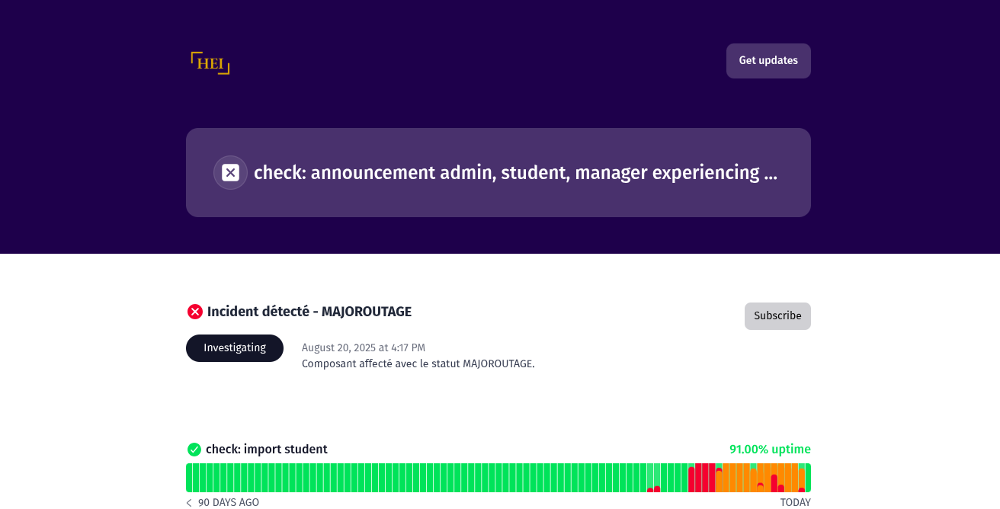

# HEI Admin UI - Cypress E2E Tests

## 📌 Description
Ce projet contient les tests **end-to-end (E2E)** pour l’application **HEI Admin UI**.  
Il permet de valider les fonctionnalités principales de l’interface utilisateur du point de vue d’un étudiant.

---




## 🛠️ Stack Technique
- **[Cypress](https://www.cypress.io/)** → Framework de test E2E.
- **JavaScript (ES6)** → Langage utilisé pour écrire les tests.
- **Node.js & npm** → Gestion des dépendances et exécution des tests.

---

## 👥 Collaborateurs
- **DyferHerios** – CP principal  
- **Noums** – Dev
- **Tsong** – Dev
- **Judy** – Dev

---

## 🔗 Liens Utiles
- [Documentation Cypress](https://docs.cypress.io/)  
- [HEI Admin preprod](https://preprod.admin.hei.school/)  
- [HEI Admin status](https://heiadmin.instatus.com/)  

---

## 🚀 Lancer les Tests
### 1Installer les dépendances
```
npm install
```
### Ouvrir l’interface graphique Cypress

```
npx cypress open
```

### Lancer les tests en mode headless
```
npm run test
```

